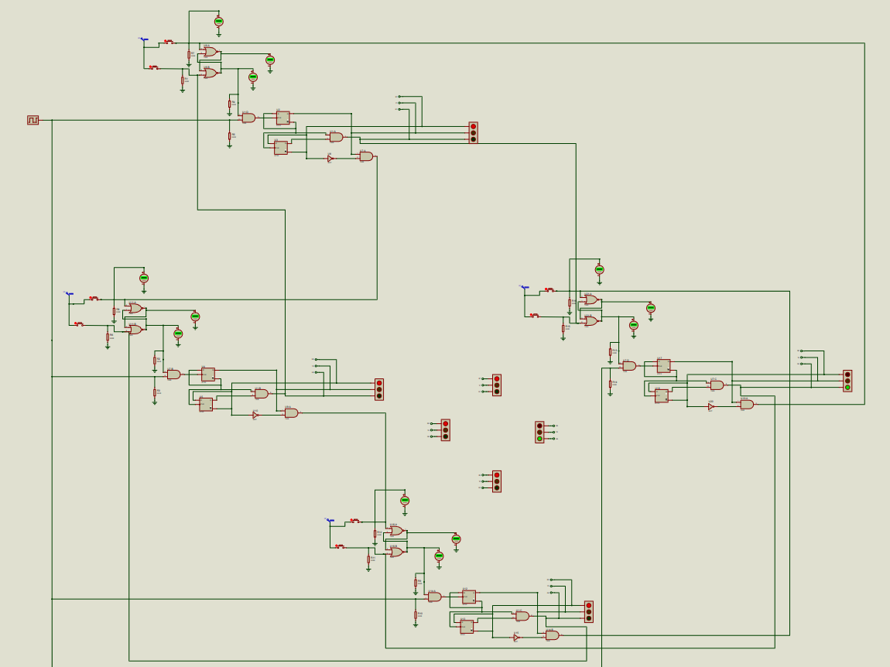

  <h1>Traffic Lights DLD Sim Proteus </h1>
  
<h3 align="center">DLD Simulation in Proteus 🚀</h3>

## 🎬 Demo

[▶️](https://www.youtube.com/watch?v=JIxCoIGWEc4)

## Description

Traffic Lights Simulation in Proteus
Without any Microcontroller
Using only Logic Gates and ICs.

For DLD LAB Semester Project

### ICs and Components Used

1.	7408 QUAD 2-Input AND GATES
2.	74LS74 (DTFF or D’Flip Flop)
3.	7402 Quad 2-Input NOR Gate
4.	Traffic Lights
5.	Switch (Button)
6.	Clock 
7.	Resistors (330-OHM)
8.	7404 Not Gate IC
9.	SR-LATCHES 
10.	Wires

# 📝 Documentation

# 📚 References

# 🤝🏻 Connect with Me

## Huzaifa Irfan

- 💬 Just want to say hi?
- 🚀 Have a project to discuss?
- 📧 Email me @: [hi@huzaifairfan.com](mailto:hi@huzaifairfan.com)
- 📞 Visit my Profile for other channels:

# 📜 License

Licensed under the GPL3 License, Copyright 2025 Huzaifa Irfan. [LICENSE](LICENSE)

Last Updated on 2021-01-03
